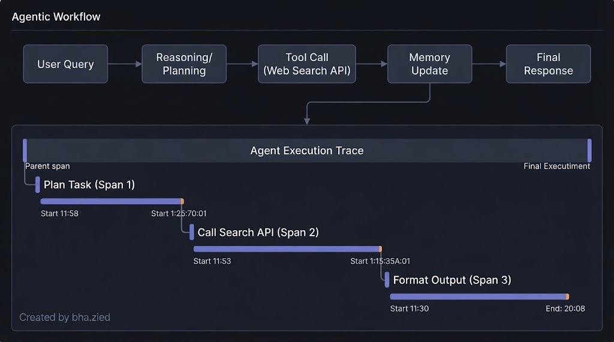
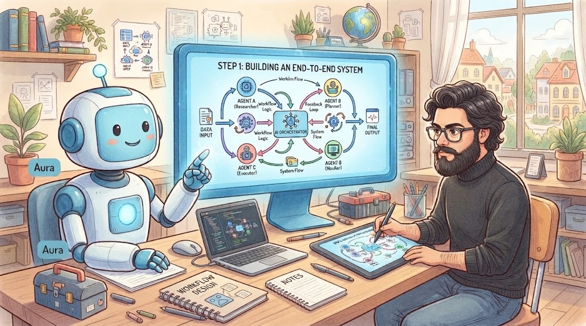
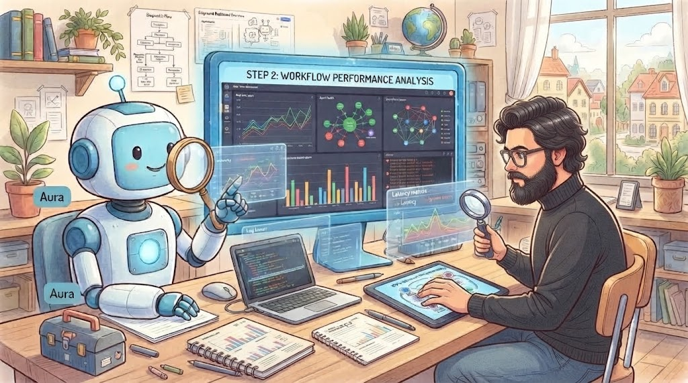
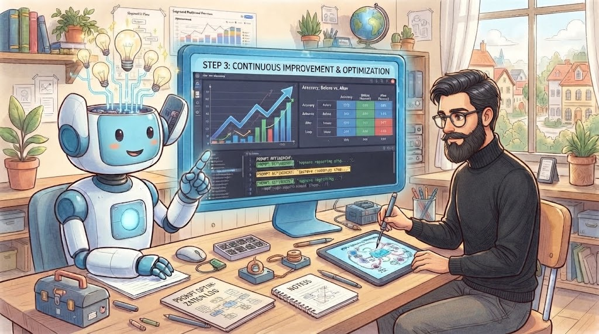

# Practical tips for building Agentic AI

### Lecture 1: Evals

The first piece of advice is to design a quick and dirty initial version to get started, then identify areas for optimization to ensure the system performs as expected, think of it as a prototype at first. For instance, create your agent-based workflow, test it with input data, log the results in a table, and check for any unsatisfactory behaviors so you can correct them. Additionally, monitor the impact of your changes (such as new prompts or algorithms) to see if they lead to improvement. In other words, evaluate the results.

There is two axe of evaluation

|                                  | Evaluation with Code (objective)                                                                                                                                                                         | Evaluation with LLM judge (subjective)                                                                                                                                               |
| -------------------------------- | -------------------------------------------------------------------------------------------------------------------------------------------------------------------------------------------------------- | ------------------------------------------------------------------------------------------------------------------------------------------------------------------------------------ |
| per example ground truth    | **Tool Call Parameter Accuracy:** Checking if API call inputs match ground-truth schemas. **State Mutation Check:** Verifying expected side-effects (e.g., row inserted in database, file created). | **Code:** Programmatic success checks (e.g., unit test pass/fail, exit code `0`). • **Trajectory Length / Step Efficiency:** Steps taken relative to theoretical lower bounds. |
| No per example ground truth | Human/LLM-as-a-Judge assessment of how closely output matches expert reference style.                                                                                                                    | Scoring coherence, tone, and safety via model criteria rubrics.                                                                                                                      |

### takeaways

- Quick and dirty to start is OK
- As you find places where your evals fail to capture humain judgment, use that as a opportunity to improve the metric.
- look to the place where performance is worse than human.

### lecture 2,3 and 4 : Error Analysis and prioritizing next step

Trace: the workflow execution cycle.
span: the step of a workflow
Now, of analysis, we decompose the trace per span and looking more rigorous wich part of the workflow cause the error.
So, how to define what step or part of workflow run wrong:

| input   | span 1 | span2 | span 3 |
| :------ | ------ | :---- | ------ |
| input 1 | ...    | error | ...    |
| input 2 | ...    | error | ...    |
| input 2 | error  | ...   | ...    |
| errors  | 10%    | 67%   | 0%     |

The table presents the various stages, with each row corresponding to an execution aimed at testing or evaluating the workflow. The result is a summary of percentages by stage, making it possible to determine which stage to focus on.

N.B.: The sum of the percentages does not equal 100% because they are not inclusive percentages.

### takeaways:

- devlop a habit to look at traces.
- Carry out error analysis to figure out what component performed poorly, leading to a poor final output
- use error analysis output to decide where to focus efforts.

### Lecture 5: How to adress problems you identify

As an agentic workflow can contain many different types of components:

1- improving non-LLM Component porformance

E.g web searsh, text retrival for RAG, code execution, traines ML Model ...

In this case:

* tune hyperparameters
* replace the component

2- improving LLM Component Performance

* Improve your prompt
* try a different model
* split up the step in smaller steps
* fine-tune a model

### Lecture 6: Latency, cost optimization

Objectif, keep the cost low per user and the best latency!

Run time:

and to optimize performance execution, you need to benshmark the whole run time. do it step by step to identify wich component consume more time and find the way to tine reduce it.

Costing:

check :

* LLM steps for token cost
* Api api calling tools (pay per api call)
* compute steps based on server capacity/cost

### lecture 7: summary

the comics strip below can summarise the process to create an agentic work flow

Step 1 : building end to end system, designing and building the core architecture system

step2 : analysis and monitoring, amalyse workflow execution, track metrics ans monitor agent decision pathway

step 3: Continuous inprovement, Iteritavely optimisation prompt structure, memory recal, cost and model reasoning steps.

Step 4: scaling and deployement, Deploying and managing autonomous agent swarms in production environment at scale.

