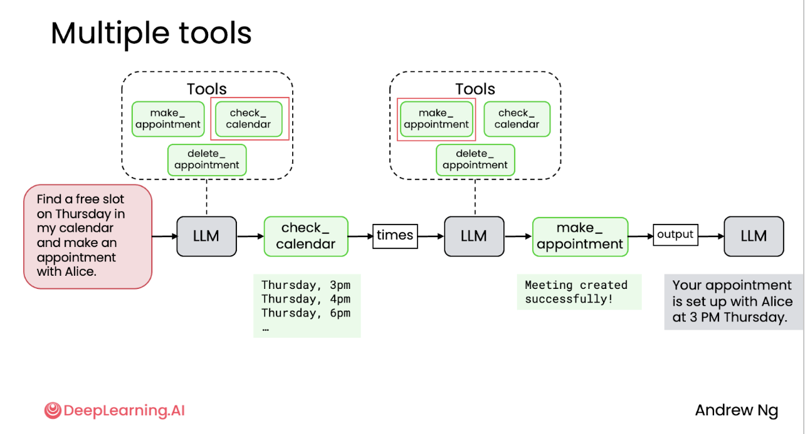
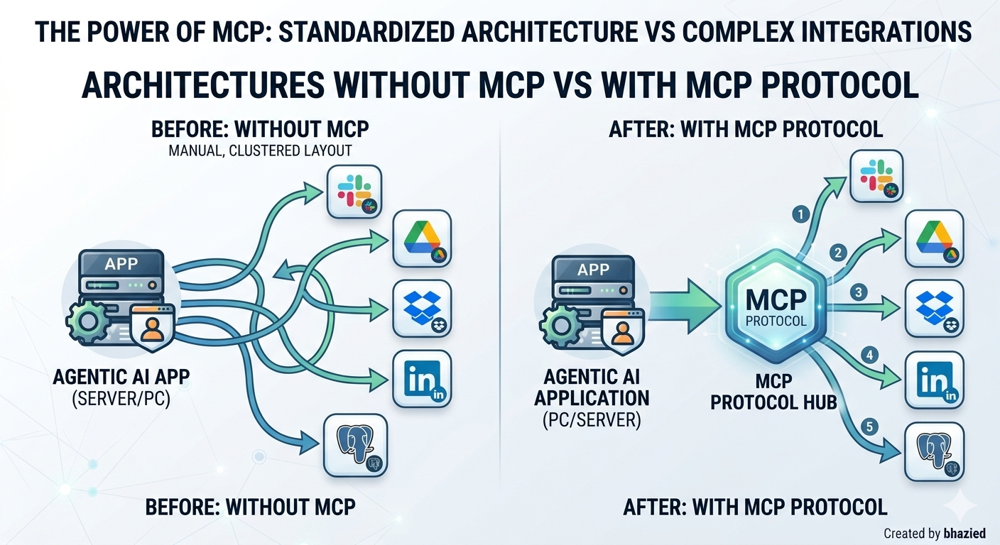

# 🛠️Tool Use

### Lecture 1 : What are Tool and ?

Genrally, we can use tool for the informations that LLM can't access to. As an exemple local storage database, if our agent use a LLM to found some data in our database then teh response from model will be :

> I dont have access to you database.

A tool is a function that provides some data to agent to be used to performe prompt. and am agent can use one or many tool to effectly accomplish its mission.

### Lecture 2: How create tool

As we say, tool is just a function, the question is how LLM use this function. imagine that we need an agent to analyse our server event log. we need a function to return every event log between to datetime as bellow

> ```python
> """
> return  a stream of events of a log_type between two date 
> """
> def get_events_log(log_type, start_time, end_time) -> Generator(tuple[str, str], null, null):
>   ....
> ```

then we can write a system prompte as example bellow

```plaintext
You have an access to a tool called get_events_log between two datetime for log type Application.
to used it, return the follwing excactly 
Function
get_evnet_log('Application', start_date, end_date)
```

Ultimately, the LLM retrieves the function's result to use as input for the next step in the agent's workflow. This example may not be ideal, as using a data stream can generate a large volume of output that once added to the user prompt consumes a significant number of tokens; nevertheless, it remains just an example.In The end the LLM get the output of function and it will be used as an input for the next step of agentic workflow. Mybe the exemple is not the goodest one because we use a streaming of date and we can havin a huge output to add it to user prompte and then we consume many tokens . but its still juste an exemple.

### Lecture 3: Tool Syntax

Based on the last function that return a stream of windows events log, bellow teh syntax to call a tool within a LLM model:

```python
import aisuite from ai
client = ai.client
rsponse = client.chat_completation_create(
   model = "model_name",
   messages = messages,
   tools = tool[get_events_log],
   max_turns = max
)

```

In backstage, this will be convertes on json format with payload as a description of the tool that we put to the LLM model

```json
tools : [
{"type": "function",
"function": {"name": "get_events_log", "description": "The comment of function",
"parameters": {}
}}
]
```

An agentic application can also designed as a workflow, and let the LLM decide what tool use  according to the prompt. Below, we can see an exemple of an agentic apoitement assistante.



#### Takeaways

* Tool calling lets LLMs go beyond text generation—they can now use functions as part of their reasoning.
* Clear, well-documented functions (with precise docstrings) help the model know when and how to use each tool.
* AISuite handles the complexity of translating python functions into tool schemas and orchestrating multi-step workflows.
* Choosing the right model matters: smaller models are faster and cheaper for simple tasks, while stronger models are better for reasoning-heavy workflows.
* Watching the conversation flow (prompts, tool calls, results, final response) is essential for debugging and improving agentic behaviors.

### Lecture 4 : Code Execution

In this lecture, we talk about code execution, and it's very helpeful feature of python or other lamguage, with a help of a LLM, an agent can ask to get some code to do anything. For Exemple, you may generate a pdf document for reporting some date. heare is what teh prompte  look likes.

> You are an expert Data Visualization and Document Generation AI. Your sole task is to ingest a structured CSV dataset provided by the user and translate its contents into a production-ready Python script using the ReportLab library to output a highly polished, professional PDF document.  ### CRITICAL REQUIREMENTS FOR PDF GENERATION: 1. EXCLUSIVE OUTPUT: Output ONLY the executable Python code block. Do not include introductory text, explanations, markdown commentary, or concluding notes.  2. COMPILATION GUARANTEE: The code must be completely self-contained. All data from the user's CSV must be hardcoded as local variables (lists of dictionaries or tuples) inside the script so it can run immediately without requiring external file access. 3. ESTHETICS & LAYOUT: - Use clean, professional color palettes (e.g., navy/slate corporate, minimalist charcoal, or clean jewel tones). - Enforce explicit page layout logic. Calculate table column widths programmatically or hardcode them proportionally to prevent text clipping at the page margins. - Wrap table cells in Paragraph flowables to allow automatic text wrapping. 4. MULTI-PAGE HANDLING: Utilize ReportLab's SimpleDocTemplate and Flowables appropriately. Ensure page headers, footers, and page numbers are dynamically generated using canvas callbacks (onFirstPage/onLaterPages) so long tables flow flawlessly across page breaks without overlapping structural text.
>
> STEP-BY-STEP WORKFLOW:
>
> 1. Parse the provided CSV file data structurally. Identify headers and data types.
> 2. Define a matching ReportLab styles hierarchy utilizing safe default fonts (Helvetica, Times-Roman, or Courier). <
> 3. Map the CSV data matrix directly into a ReportLab Table or layout structure.
> 4. Output the complete, fully formed Python script wrapped cleanly dilimited by ```python ```

then you get the output and extract the code and executed as below:

```python
import re
text = out_put
match = re.search(r"```python\s*(.*?)\s*```", text, flags=re.DOTALL)
if match:
   code = match.group(1)
   print("--- Executing Code ---")
   exec(code)
 else:
   print("No Python code block found.")

```

#### Takeaways

- Secure code execution and execution outside a sendbox can be risky.
- in dev environment use a sandbox to minimise risque, like a docker env.
- check if the code doesn't contain a commad like rm, os.environ, can used to the production env.

look at the this python file [secure_code_agent](secure_code_agent.py)

### Lecture 5 : MCP

MCP: The Model Context Protocol, is a standard proposed by Anthropic campany to give for a LLM more access to more tools



SO the benefict of MCP vs the no MCP (Traditional API integration) is that it provide an unified and reusable translation layer instead of write a custom code to connect every single application code to every unique tool.
